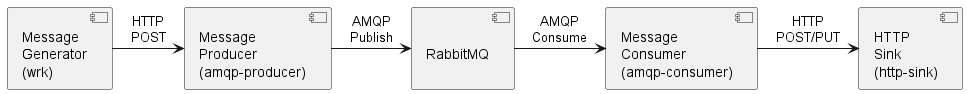

# Rust AMQP/HTTP Gateway Example

[![MIT or Apache 2.0 licensed][license-badge]][license-url]
[![Dependencies][dependencies-badge]][dependencies-url]

[license-badge]: https://img.shields.io/badge/license-MIT%20or%20Apache%202.0-blue
[license-url]: https://github.com/mracsko/amqp-service/blob/master/LICENSE.md
[dependencies-badge]: https://deps.rs/repo/github/mracsko/rust-amqp-http-gateway
/status.svg
[dependencies-url]: https://deps.rs/repo/github/mracsko/rust-amqp-http-gateway

AMQP/HTTP Gateway services for sending messages to RabbitMQ queue from HTTP endpoint or receiving messages and sending
it to a webhook (HTTP POST/PUT).

The default setup starts a RabbitMQ service, generates messages with wrk (message-generator) and calls the HTTP endpoint
on amqp-producer. The producer publish the messages to RabbitMQ.

RabbitMQ delivers the messages to the amqp-consumer, that calls a webhook (http-sink) to simulate message processing.

## Documentation

* [Quick Start](doc/quick-start.md)
* [Services](doc/services.md)

## License

This project is licensed under either of the following licenses, at your option:

- Apache License, Version 2.0, ([LICENSE-APACHE](LICENSE-APACHE) or [http://www.apache.org/licenses/LICENSE-2.0])
- MIT license ([LICENSE-MIT](LICENSE-MIT) or [http://opensource.org/licenses/MIT])